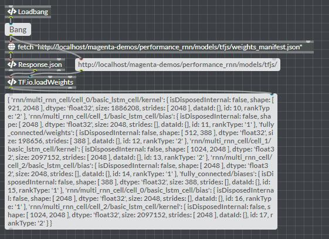

# [WebAudio-Patcher](https://fr0stbyter.github.io/)  

A web environment allows you to play with JavaScript and WebAudio.

It's a playground, Every function, variable, method or object are boxes patching with each other. Messages are passing from right to left. (as MaxMSP)

## Examples

Listen MouseMove event, than transform the value to the frequency used to generate a sine wave. Then you can visalize your spectrum.

Or Fetch a Tensorflow model.

Or try [Performance RNN](https://magenta.tensorflow.org/performance-rnn) with TensorFlow.js and [Faust](https://faust.grame.fr)

https://fr0stbyter.github.io/webaudio-patcher/#prnn.json

## Usage

Press N or double click to create a new box.

Press M to create a message.

Ctrl + Click to Lock / Unlock patcher.